# aidf-interview

# Preview Link
https://aidf.gpaul.cc

# System Architecture

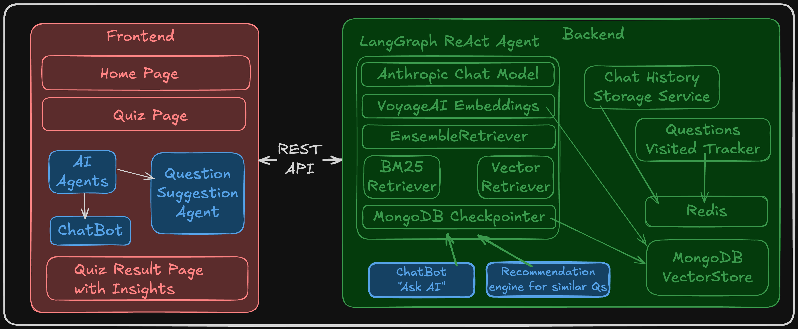

# Preview: Desktop

| 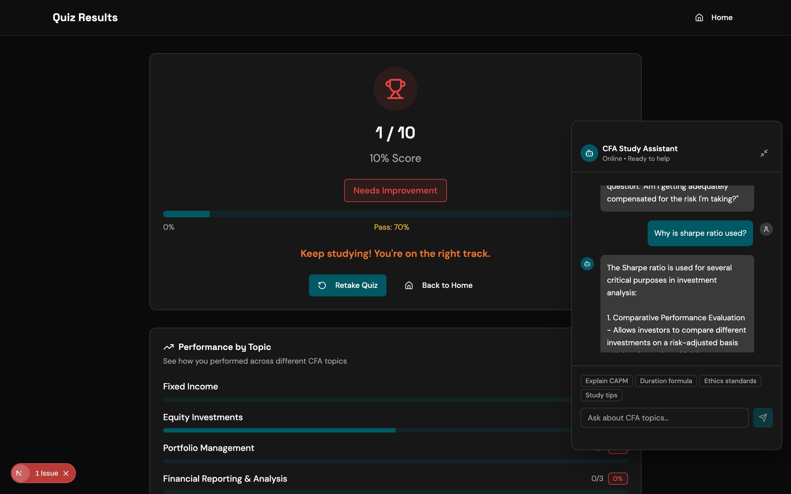 | 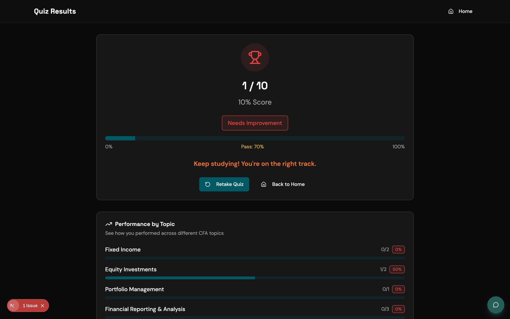 | 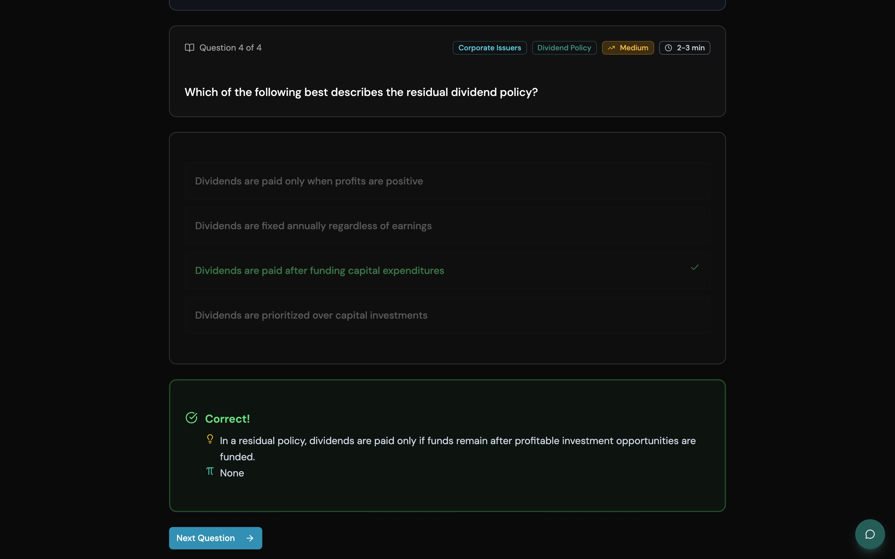 |
| ---------------------------------- | ---------------------------------- | ---------------------------------- |
| 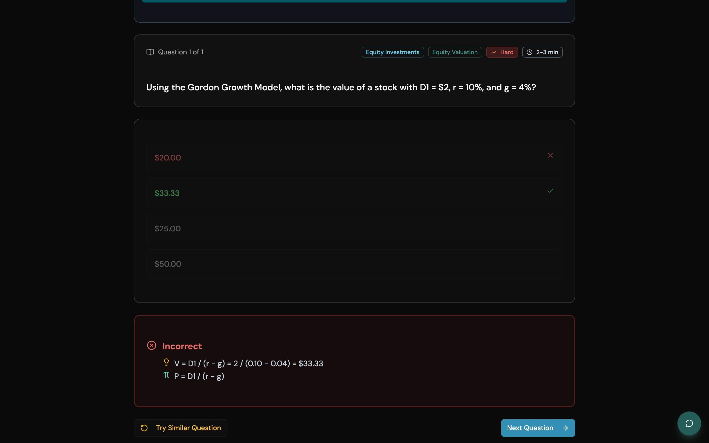 | 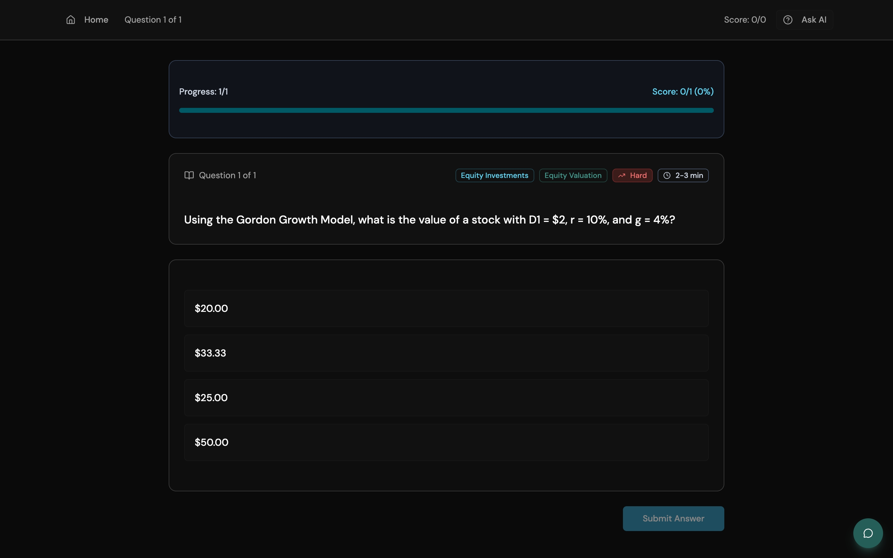 |  |

# Preview: Phone

| 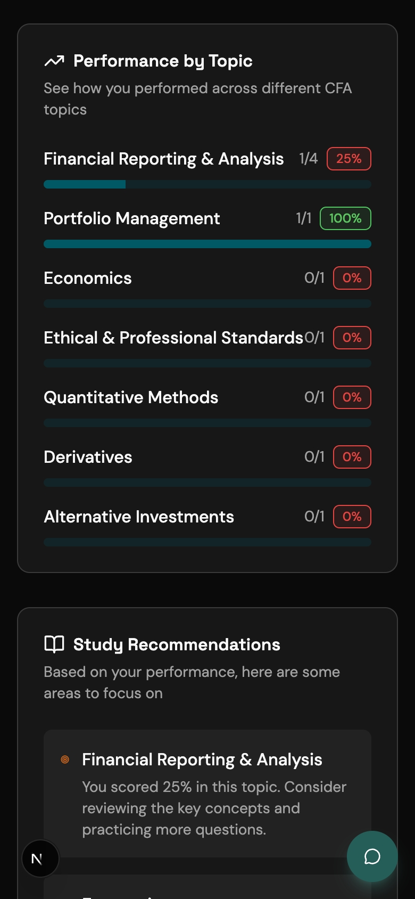 | 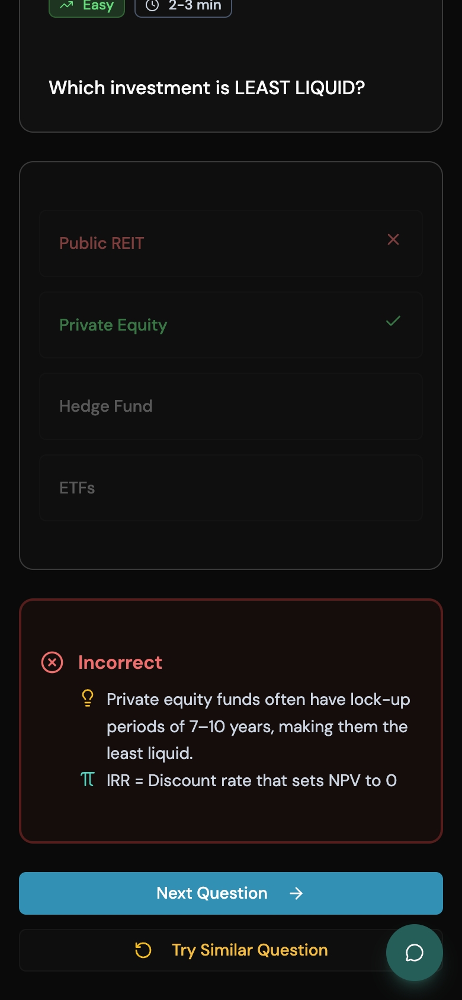 |  |
| ------------------------------ | ------------------------------ | ------------------------------ |
| 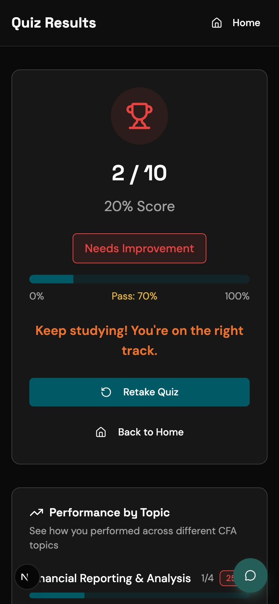 | 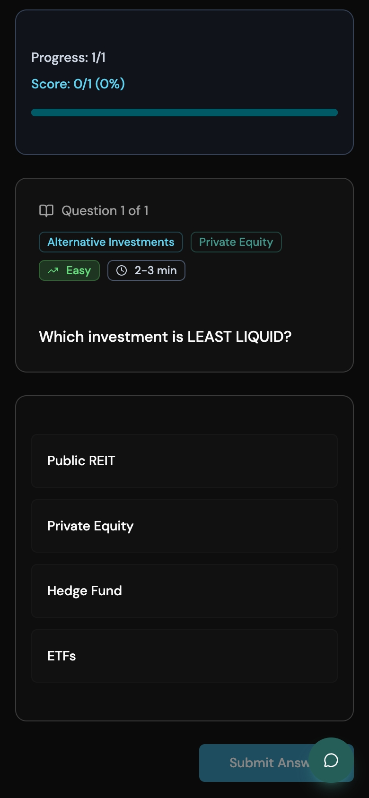 | 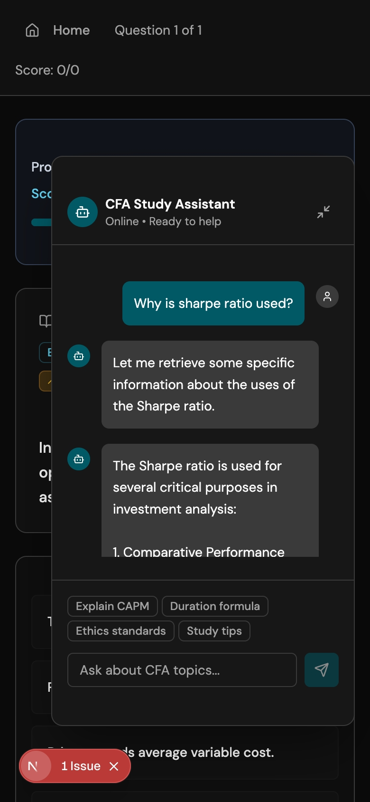 |

# Stack Used

## Frontend:

- Next.JS
- Vercel v0 for wire-framing and mock UI
- Lucide React for icons
- Tailwind for CSS

### Execution Instructions:

- ```
    cd client
  ```
- ```
  npm install
  ```
- copy the `.env.example` file and create a `.env.local` file

- ```
    npm run dev
  ```

## Backend:

- Express.JS in TypeScript
- LangGraph ReAct agent for RAG agents (both question suggestion, and chat bot)
- MongoDB for vector store
- Anthropic for chat model
- BM25 and vector store ensemble retriever with equal weighted
- Redis for ephemeral storage and chat history storage

### Execution Instructions:

- ```
    cd server
  ```
- ```
  npm install
  ```
- copy the `.env.example` file and create a `.env` file

- ```
    npm run dev
  ```

# More about the RAG agent(s)
There are two ReAct agents running in the system, one agent makes sure that the user always has a chat button to ask questions, which it can answer based on the [question bank](./server/src/data/questions.ts) provided for this task and the other agent tries to find out similar problems which the user can solve, in the case they make mistakes while answering the questions. They can try out similar questions suggested by the AI, and can improve their learning. Both the agents are written using pre-built LangGraph agents, and are provided the JSON data in the form of embeddings. Since we were supposed to use Anthropic for the chat model, I decided to move forward with VoyageAI embeddings. After loading the documents into the system, and then using the recursive text splitter to split into smaller chunks, I embedded them into vectors using the Voyage AI model. The embeddings were then stored in MongoDB which acted as the choice of vector store for this project. To maintain persistence of memory and state of the graph, I've also used MongoDB as the choice of checkpointer for the graph. Additionally, I used Redis to maintain the state of the messages unique to a thread. The backend uses cookies to set and maintain chat history, questions visited and the state of the graph. Redis is also used to keep track of the already visited questions, so that the user does not get stuck in a loop solving the same set of questions.
